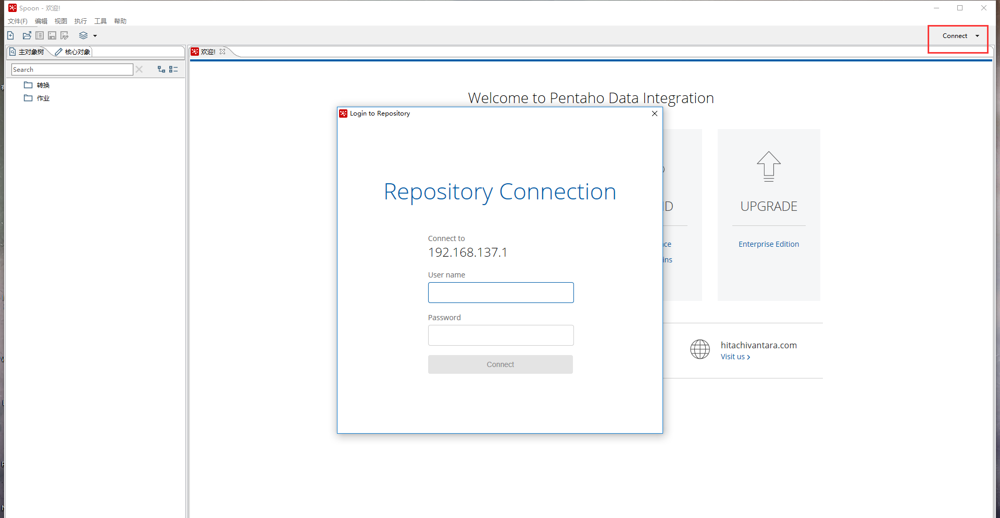

## 数据库资源库

连接数据库资源库

本地创建一个库，连接后会生成kettle的表

默认用户名密码 admin/admin

## 表

### r_job 作业定义表

ID_JOB 作业ID，全表唯一

ID_DIRECTORY，作业目录，对应目录表

NAME，作业名称，可以重复，建议不要

### r_directory 目录表

ID_DIRECTORY 目录ID，全表唯一

ID_DIRECTORY_PARENT 父目录ID，0表示顶级目录

DIRECTORY_NAME 目录名称

### r_database 数据库记录表

ID_DATABASE 数据库ID，全表唯一

NAME 数据库连接名称

ID_DATABASE_TYPE 数据库类型，对应数据库类型表

ID_DATABASE_CONTYPE 数据库连接方式，对应数据库连接方式表

HOST_NAME

DATABASE_NAME

PORT

USERNAME

PASSWORD

### r_database_type 数据库类型表

ID_DATABASE_TYPE 数据库类型ID，全表唯一

CODE PDI支持的数据库类型

DESCRIPTION 说明

### r_database_contype 数据库连接类型表

ID_DATABASE_CONTYPE 数据库连接类型ID，全表唯一

CODE PDI支持的数据库连接方式，一般是Native (JDBC)

DESCRIPTION 说明

### r_database_attribute 数据库连接参数表

ID_DATABASE_ATTRIBUTE 数据库连接参数ID，全表唯一

ID_DATABASE 对应的数据库表ID

CODE 参数类型

VALUE_STR 参数值

### r_loglevel 日志级别表

ID_LOGLEVEL 日志级别ID，全表唯一

CODE PDI支持的日志级别

DESCRIPTION 说明

### r_slave 集群服务器表

子服务器表，远程运行任务的时候选择的Carte服务器

ID_SLAVE 服务器ID，全表唯一

NAME 服务器名，建议全局唯一

HOST_NAME 服务器IP

PORT 端口

WEB_APP_NAME 选填

USERNAME 用户名，默认cluster

PASSWORD 用户名，默认cluster

PROXY_HOST_NAME 代理IP，一般不填

PROXY_PORT 代理端口，一般不填

NON_PROXY_HOSTS 是否代理主机，一般不填

MASTER 主服务器ID，默认为0，即独立的子服务器

### r_user 资源库用户表

ID_USER 用户ID，全表唯一

LOGIN 用户名

PASSWORD 密码

NAME 用户类型

DESCRIPTION 说明

ENABLED 是否启用，1表示启用

其他的表可以通过表名比较直观的看出来关系

Job有hop和step，step对应到transformation

### 说明

如果要用到PDI的API来做自己的界面控制（设计作业），才需要理解每一个表是什么关系，从工作量来说是没必要的，不然上面的就够开发一个简单的管理界面了。

