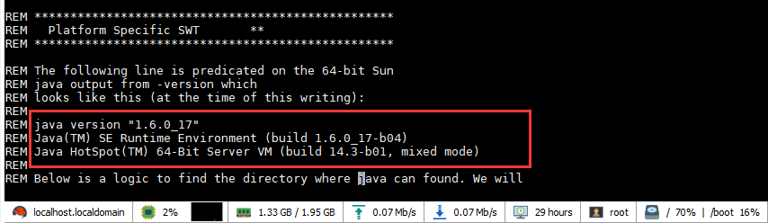
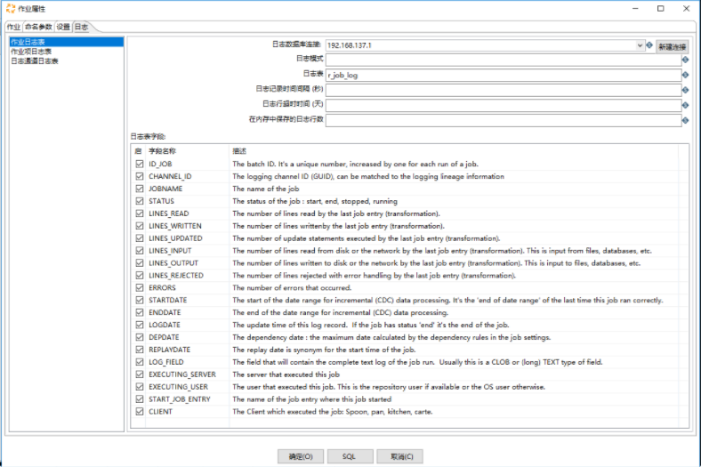
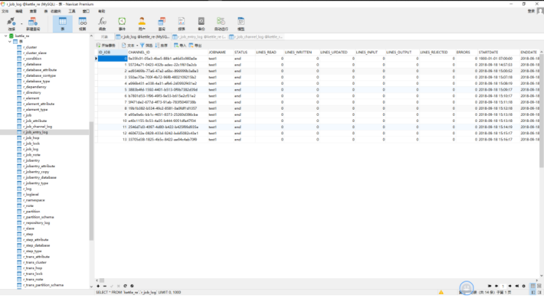

## 在linux环境下使用kettle

### 安装JDK1.8以上

参考链接：https://blog.csdn.net/zzq900503/article/details/51879745

版本要求

vi Spoon.bat



### 安装PDI

参考

https://blog.csdn.net/zzq900503/article/details/79110810

直接解压即可

```shell
[root@localhost data-integration]# pwd
/opt/kettle/data-integration
[root@localhost data-integration]#
```

### 执行作业

一般用kitchen.sh即可，转换建议包裹一个作业

数据库资源库执行的命令，注意要指定目录和作业名称

```shell
./kitchen.sh -rep=192.168.137.1 -user=admin -pass=admin -dir="/lotestasync" -listjobs
```

```shell
./kitchen.sh -rep=192.168.137.1 -user=admin -pass=admin -dir="/lotestasync" -job="test1"
```

### 加入定时执行

kettle任务配置是支持定时执行的，但是这样的问题在于kettle应用程序会一直停留在前台，会导致内存溢出等问题

所以建议使用linux的crontab或者spring quartz定时器

演示crontab的例子：

定时执行的脚本

必须加source，定时任务不识别环境变量

日志文件10MB之后新建一个

```shell
[root@localhost .kettle]# cat cron_test1.sh
#!/bin/sh

source ~/.bash_profile
source /etc/profile
filename=/root/.kettle/test.log
filesize=`ls -l $filename | awk '{ print $5 }'`
maxsize=$((1024*1024*10))
if [ $filesize -gt $maxsize ]
then
    mv /root/.kettle/test.log /root/.kettle/test"`date +%Y-%m-%d_%H:%M:%S`".log
fi

/opt/kettle/data-integration/kitchen.sh -rep=192.168.137.1 -user=admin -pass=admin -dir="/lotestasync" -job="test1" -level=Rowlevel>>/root/.kettle/test.log
```

使用crontab - 每分钟执行

```shell
[root@localhost .kettle]# crontab -l
*/1 * * * * /root/.kettle/cron_test1.sh
[root@localhost .kettle]#
```

重启服务

```shell
service crond restart
```

如果是写入数据库的日志，就要在作业中配置数据库日志链接





