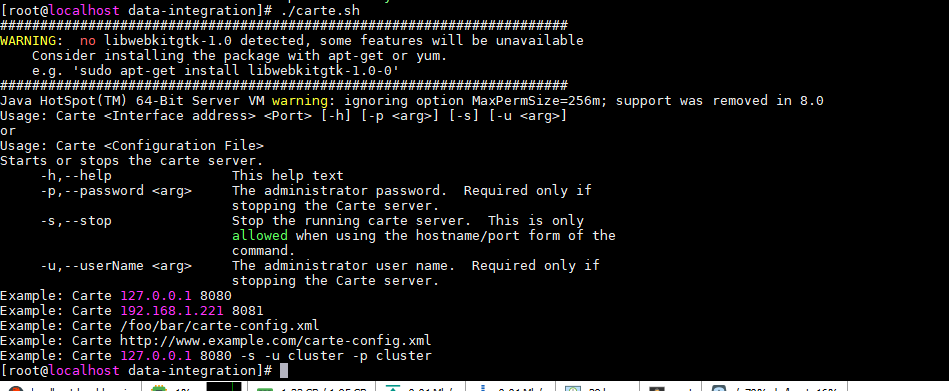
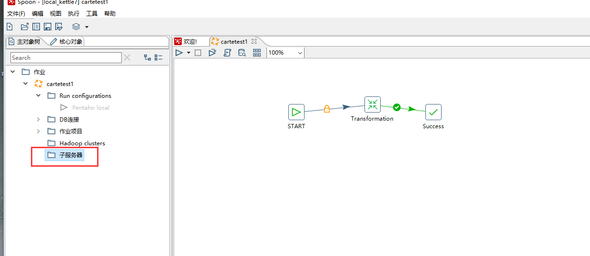
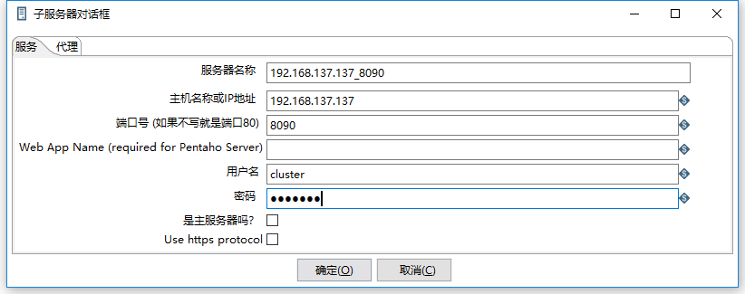
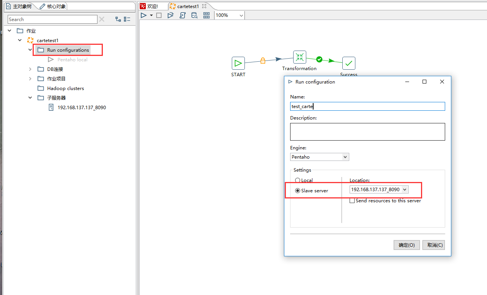
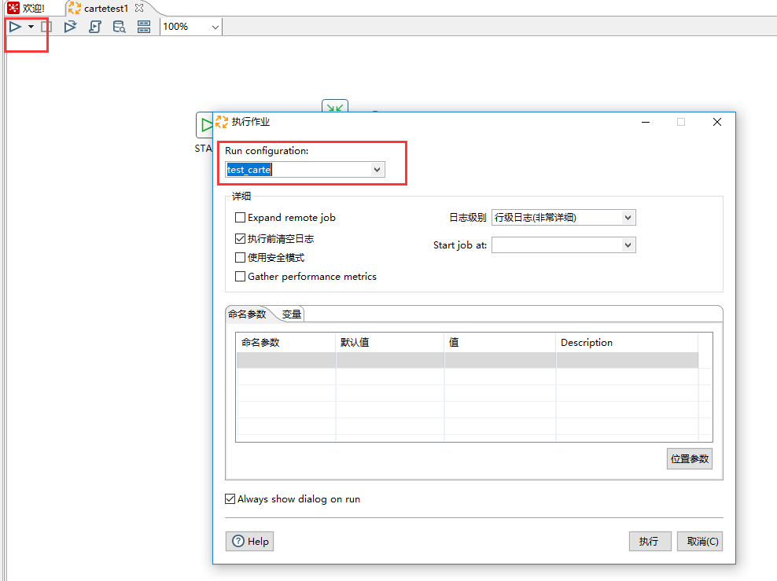
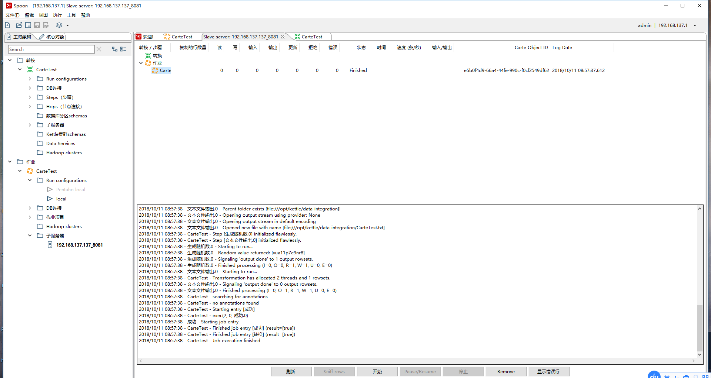
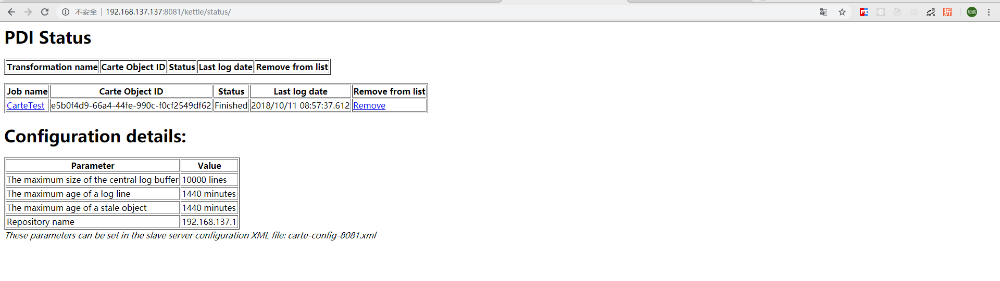
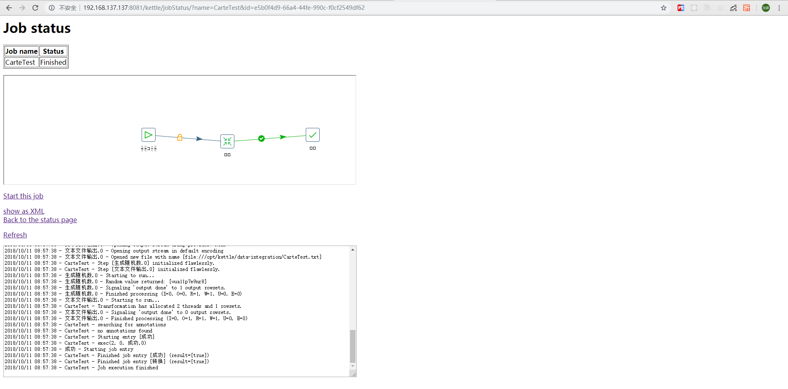

参考

http://www.cnblogs.com/John-Young/p/6349252.html

https://wenku.baidu.com/view/fb20216858fafab069dc0241.html

说明，不涉及集群搭建，只是远程执行作业的设定


### 使用场景

本地设计好job之后，本地无法连接到目标数据库的时候，需要上传到某个可以连接数据库的服务器（安装了PDI）执行。

### 启动服务器

参考命令：



```shell
./carte.sh 192.168.137.137 8090  -u cluster -p cluster
```

配置参考

https://wiki.pentaho.com/display/EAI/Carte+Configuration

https://help.pentaho.com/Documentation/7.0/0L0/0Y0/060/060

配置文件：

carte-config-8081.xml

没有做集群，所以删除master部分的配置，示例配置在pwd目录下

```xml
<slave_config>
  <!-- 
     Document description...
     
     - masters: You can list the slave servers to which this slave has to report back to.
                If this is a master, we will contact the other masters to get a list of all the slaves in the cluster.

     - report_to_masters : send a message to the defined masters to let them know we exist (Y/N)

     - slaveserver : specify the slave server details of this carte instance.
                     IMPORTANT : the username and password specified here are used by the master instances to connect to this slave.

  -->

  <slaveserver>
    <name>slave1-8081</name>
    <hostname>192.168.137.137</hostname>
    <port>8081</port>
    <username>cluster</username>
    <password>cluster</password>
    <master>N</master>
  </slaveserver>

  <max_log_lines>10000</max_log_lines>
  <max_log_timeout_minutes>1440</max_log_timeout_minutes>
  <object_timeout_minutes>1440</object_timeout_minutes>

  <repository>
  <name>192.168.137.1</name>
  <username>admin</username>
  <password>admin</password>
</repository>

</slave_config>

```

需要拷贝repositories.xml到PDI的目录下，可以在windows平台下直接连接资源库，会在当前用户目录下的.kettle目录下生产这个文件，直接拷贝到linux平台即可

```xml
<?xml version="1.0" encoding="UTF-8"?>
<repositories>
  <connection>
    <name>192.168.137.1</name>
    <server>192.168.137.1</server>
    <type>MYSQL</type>
    <access>Native</access>
    <database>kettle_re</database>
    <port>3306</port>
    <username>root</username>
    <password>Encrypted 2be98afc86aa7f2e4cb79ff228dc6fa8c</password>
    <servername/>
    <data_tablespace/>
    <index_tablespace/>
    <attributes>
      <attribute><code>EXTRA_OPTION_MYSQL.useSSL</code><attribute>true</attribute></attribute>
      <attribute><code>FORCE_IDENTIFIERS_TO_LOWERCASE</code><attribute>N</attribute></attribute>
      <attribute><code>FORCE_IDENTIFIERS_TO_UPPERCASE</code><attribute>N</attribute></attribute>
      <attribute><code>IS_CLUSTERED</code><attribute>N</attribute></attribute>
      <attribute><code>PORT_NUMBER</code><attribute>3306</attribute></attribute>
      <attribute><code>PRESERVE_RESERVED_WORD_CASE</code><attribute>Y</attribute></attribute>
      <attribute><code>QUOTE_ALL_FIELDS</code><attribute>N</attribute></attribute>
      <attribute><code>STREAM_RESULTS</code><attribute>Y</attribute></attribute>
      <attribute><code>SUPPORTS_BOOLEAN_DATA_TYPE</code><attribute>Y</attribute></attribute>
      <attribute><code>SUPPORTS_TIMESTAMP_DATA_TYPE</code><attribute>Y</attribute></attribute>
      <attribute><code>USE_POOLING</code><attribute>N</attribute></attribute>
    </attributes>
  </connection>
  <connection>
    <name>127.0.0.1</name>
    <server>localhost</server>
    <type>MYSQL</type>
    <access>Native</access>
    <database>kettle7</database>
    <port>3306</port>
    <username>root</username>
    <password>Encrypted 2be98afc86aa7f2e4cb79ff228dc6fa8c</password>
    <servername/>
    <data_tablespace/>
    <index_tablespace/>
    <attributes>
      <attribute><code>FORCE_IDENTIFIERS_TO_LOWERCASE</code><attribute>N</attribute></attribute>
      <attribute><code>FORCE_IDENTIFIERS_TO_UPPERCASE</code><attribute>N</attribute></attribute>
      <attribute><code>IS_CLUSTERED</code><attribute>N</attribute></attribute>
      <attribute><code>PORT_NUMBER</code><attribute>3306</attribute></attribute>
      <attribute><code>PRESERVE_RESERVED_WORD_CASE</code><attribute>Y</attribute></attribute>
      <attribute><code>QUOTE_ALL_FIELDS</code><attribute>N</attribute></attribute>
      <attribute><code>STREAM_RESULTS</code><attribute>Y</attribute></attribute>
      <attribute><code>SUPPORTS_BOOLEAN_DATA_TYPE</code><attribute>Y</attribute></attribute>
      <attribute><code>SUPPORTS_TIMESTAMP_DATA_TYPE</code><attribute>Y</attribute></attribute>
      <attribute><code>USE_POOLING</code><attribute>N</attribute></attribute>
    </attributes>
  </connection>
  <repository>    <id>KettleDatabaseRepository</id>
    <name>192.168.137.1</name>
    <description>Database repository</description>
    <is_default>false</is_default>
    <connection>192.168.137.1</connection>
  </repository>  <repository>    <id>KettleDatabaseRepository</id>
    <name>local_kettle7</name>
    <description>Database repository</description>
    <is_default>false</is_default>
    <connection>127.0.0.1</connection>
  </repository>  </repositories>

```


### 两种运行方式

#### 在windows下执行

打开Spoon设计工具

打开Job

新建服务器



填入信息



填入运行配置信息



运行选项，选择远程服务器



执行结果：



WEB界面查看日志






以上就完成一个远程服务器了


