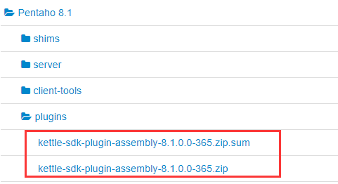
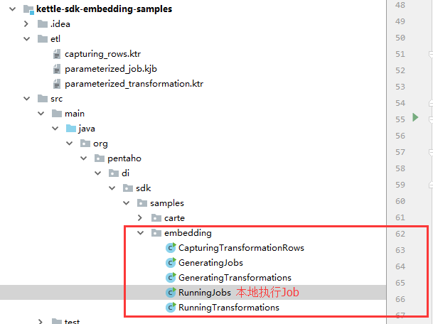
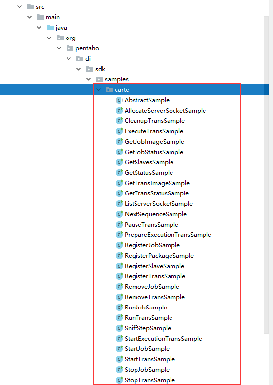
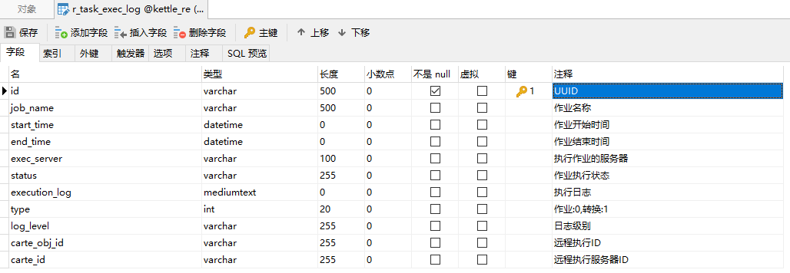
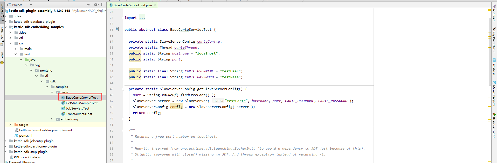
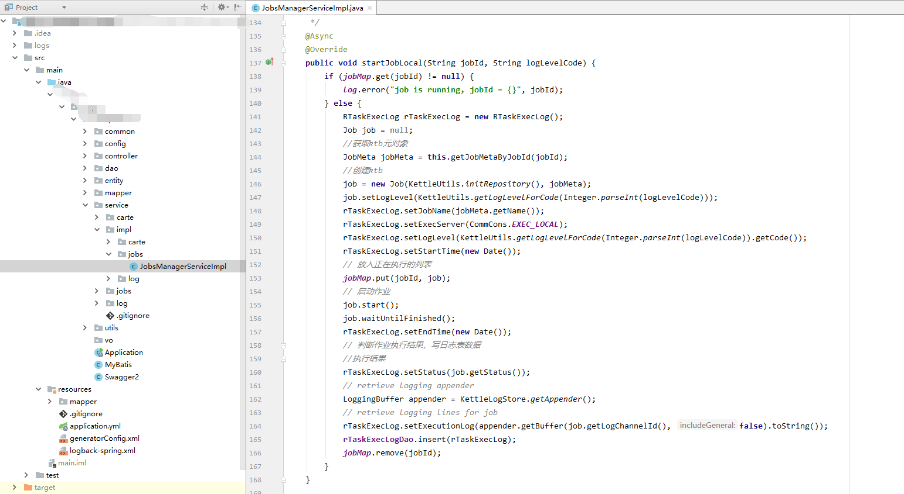

可供参考的开源项目：

1. https://gitee.com/1967988842/kettle-master/tree/master
2. https://github.com/JoeyBling/webkettle
3. https://github.com/majinju/kettle-manager

## 官网资料

https://help.pentaho.com/Documentation/8.1/Developer_Center

Java的看这个章节：Embed and Extend Pentaho Functionality

https://help.pentaho.com/Documentation/8.1/Developer_Center/PDI

获取示例代码：kettle-sdk-plugin-assembly-8.1.0.0-365.zip 

下载地址：https://zh.osdn.net/projects/sfnet_pentaho/releases/



导入到IDEA中

参考kettle-sdk-embedding-samples这个包，官方提供了2种方式用于运行Job

1. 直接在Java应用中启动PDI执行任务



2. 在Java应用中启动Carte，执行任务



## 集成

### 思路

1. 不支持运行定时的Job，不要使用kettle自带的定时器执行Job，使用quartz实现，不支持运行转换，必须包裹一个Job执行，方便管理
2. 资源库选择数据库资源库，方便迁移，但是，不利于作业管理和导入导出(无法直观的看到作业和转换的联系关系)
3. 本地运行Job可以采用2种方式，1是直接在Java代码中运行Job，2是本地使用一个监听器启动一个Carte线程，用于处理Job，可以直接采用第二种，这样可以扩展下面的远程执行Job代码
4. 远程执行Job，使用Carte提供的Job类的sendToSlaveServer()方法直接发送给指定服务器
5. 扩展1张作业日志表



6. 框架，使用springboot
7. 数据库，使用mysql，持久层框架使用mybatis-plus
8. 前端，使用react+antd
9. 后端，使用RESTful的API

### 问题

1. 使用监听器，启动一个本地的Carte线程，报错问题未解决

按照模板提供的



继承ServletContextListener接口，来执行上面的代码

```java
SystemLoadListener implements ServletContextListener
```

2. 没有把设计器集成进来

这个demo提供了B版的设计器，https://github.com/JoeyBling/webkettle

但是实际测试不能保存，而且项目没有维护了

单独再开发一个web界面的设计器成本很高

3. 本地每次执行一个Job需要开启一个新的线程，使用springboot的@Async注解实现


## 开发

### 初始化项目

使用springboot的start.io网站初始化项目

勾选devtool/web/mybatis

引入swagger/druid/mysql-connector

引入jackson用于格式化日期时间

引入mybatis-plus

### 引入包

参考示例包的pom.xml，引入kettle的包

```xml
<!--kettle的依赖-->
    <properties>
        <eula-wrap_create-dist-phase></eula-wrap_create-dist-phase>
        <eula-wrap_assign-deps-to-properties-phase></eula-wrap_assign-deps-to-properties-phase>
        <mockito.version>1.10.19</mockito.version>
        <pentaho-metadata.version>8.1.0.0-365</pentaho-metadata.version>
        <eula-wrap_create-izpack-installer-jar-phase></eula-wrap_create-izpack-installer-jar-phase>
        <pdi.version>8.1.0.0-365</pdi.version>
        <eula-wrap_attach-dist-phase></eula-wrap_attach-dist-phase>
        <junit.version>4.12</junit.version>
        <jersey.version>1.19.1</jersey.version>
        <jsr311-api.version>1.1.1</jsr311-api.version>
    </properties>

<!--kettle的仓库-->
        <repository>
            <id>pentaho-public</id>
            <name>Pentaho Public</name>
            <url>http://nexus.pentaho.org/content/groups/omni/</url>
            <releases>
                <enabled>true</enabled>
                <updatePolicy>daily</updatePolicy>
            </releases>
            <snapshots>
                <enabled>false</enabled>
                <updatePolicy>interval:15</updatePolicy>
            </snapshots>
        </repository>

<!--kettel依赖包 start-->
        <dependency>
            <groupId>pentaho-kettle</groupId>
            <artifactId>kettle-core</artifactId>
            <version>${pdi.version}</version>
            <exclusions>
                <exclusion>
                    <artifactId>xercesImpl</artifactId>
                    <groupId>xerces</groupId>
                </exclusion>
                <exclusion>
                    <artifactId>commons-httpclient</artifactId>
                    <groupId>commons-httpclient</groupId>
                </exclusion>
            </exclusions>
        </dependency>
        <dependency>
            <groupId>pentaho-kettle</groupId>
            <artifactId>kettle-engine</artifactId>
            <version>${pdi.version}</version>
        </dependency>
        <dependency>
            <groupId>org.pentaho.di.plugins</groupId>
            <artifactId>pdi-core-plugins-impl</artifactId>
            <version>${pdi.version}</version>
        </dependency>
        <dependency>
            <groupId>org.apache.httpcomponents</groupId>
            <artifactId>httpclient</artifactId>
            <version>4.5.3</version>
        </dependency>
        <dependency>
            <groupId>junit</groupId>
            <artifactId>junit</artifactId>
            <version>${junit.version}</version>
            <scope>test</scope>
        </dependency>
        <dependency>
            <groupId>org.mockito</groupId>
            <artifactId>mockito-all</artifactId>
            <version>${mockito.version}</version>
            <scope>test</scope>
        </dependency>
        <dependency>
            <groupId>xerces</groupId>
            <artifactId>xercesImpl</artifactId>
            <version>2.9.1</version>
            <scope>test</scope>
            <exclusions>
                <exclusion>
                    <artifactId>*</artifactId>
                    <groupId>*</groupId>
                </exclusion>
            </exclusions>
        </dependency>
        <dependency>
            <groupId>commons-cli</groupId>
            <artifactId>commons-cli</artifactId>
            <version>1.3.1</version>
            <scope>test</scope>
        </dependency>
        <dependency>
            <groupId>com.sun.jersey</groupId>
            <artifactId>jersey-core</artifactId>
            <version>${jersey.version}</version>
            <scope>test</scope>
        </dependency>
        <dependency>
            <groupId>com.sun.jersey</groupId>
            <artifactId>jersey-client</artifactId>
            <version>${jersey.version}</version>
            <scope>test</scope>
        </dependency>
        <dependency>
            <groupId>com.sun.jersey</groupId>
            <artifactId>jersey-bundle</artifactId>
            <version>${jersey.version}</version>
            <scope>test</scope>
        </dependency>
        <dependency>
            <groupId>javax.ws.rs</groupId>
            <artifactId>jsr311-api</artifactId>
            <version>${jsr311-api.version}</version>
            <scope>test</scope>
        </dependency>
        <dependency>
            <groupId>javax.servlet</groupId>
            <artifactId>javax.servlet-api</artifactId>
            <version>3.0.1</version>
            <scope>test</scope>
        </dependency>
        <!--kettel依赖包 end-->
```

### 生成DAO/Entity

使用Mybatis-plus的代码生成器生成DAO和实体

https://mp.baomidou.com/

### 功能规划

#### JobController

1. 获取Job列表
2. 查看Job详情
3. 获取Job目录
4. 删除Job
5. 运行Job：可选远程或者本地
6. 停止Job：可选远程或者本地
7. 重启Job：可选远程或者本地
8. 获取正在执行的Job：可选远程或者本地
9. 导入ktr/kjb到数据库资源库
10. 从数据库资源库导出ktr/kjb到本地

#### LogController

1. 分页获取所有执行日志
2. 获取Job的单个日志文本
3. 根据JobID获取Job的所有日志

#### CarteSlaveController

1. 获取Carte服务器列表
2. 获取在线的Carte服务器列表
3. 获取指定服务器状态信息
4. 增删改服务器信息
5. 获取指定服务器运行的Job列表

### 代码实现

以本地执行作业为例




